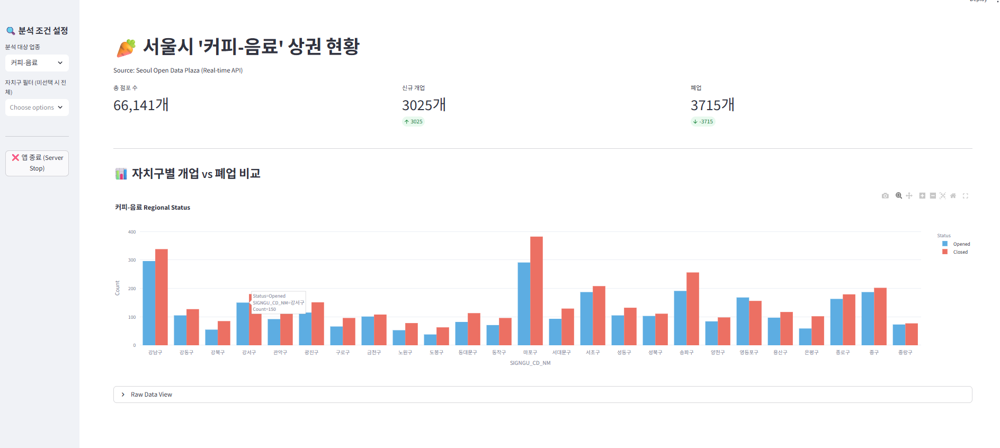
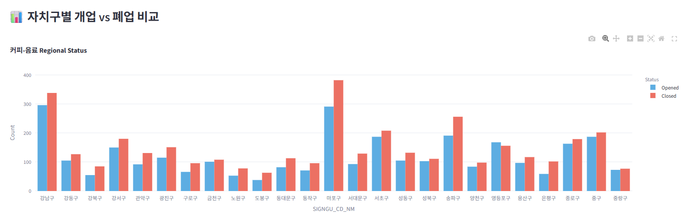

# 🛒 Seoul Local Market Analysis Pipeline


서울시 열린데이터 광장 API를 활용하여 상권 데이터를 수집, 전처리하고 시각화하는 **E2E(End-to-End) 데이터 파이프라인 및 대시보드** 프로젝트입니다.

## 📸 대시보드 주요 화면

| **메인 대시보드 (Dashboard Main)** | **지역별 상세 분석 (Regional Analysis)** |
|:---:|:---:|
|  |  |
> *현재 대시보드는 서울시 상권 API를 통해 수집된 **약 300,000건의 대규모 데이터**를 기반으로 분석한 결과입니다.*

---

## 🚀 Live Demo (웹에서 바로 실행하기)
별도의 설치 없이, 배포된 웹 애플리케이션을 통해 즉시 대시보드를 체험하실 수 있습니다.

* **🔗 대시보드 링크:** **[👉 Seoul Local Market Analysis App 바로가기](https://jamesrhee1-seoul-local-market-analysis-app-1wzjm0.streamlit.app/)**

---

## 🎯 Project Motivation: Why Market Dynamics?

이 프로젝트는 **에이블리(Ably)의 핵심 경쟁력인 '빠른 트렌드 캐치'와 '마켓 생태계**를 데이터 엔지니어링 관점에서 해석하기 위해 시작되었습니다.

치열한 커머스 환경에서 **브랜드(또는 셀러)의 생존과 성장 주기**를 파악하는 것은 비즈니스 의사결정의 핵심입니다. 저는 서울시 상권 데이터를 활용하여, 변화무쌍한 시장 데이터를 처리하는 엔지니어링 역량과 이를 비즈니스 인사이트로 연결하는 과정을 시뮬레이션했습니다.

### 🚀 1. 트렌드 센싱(Trend Sensing) 파이프라인 구축
방대한 시장 데이터를 시계열로 수집 후 적재하여, **급변하는 시장 상황**을 즉각적으로 모니터링할 수 있는 데이터 파이프라인을 구축했습니다. 이는 에이블리의 신규 브랜드 발굴 및 카테고리 확장에 필요한 데이터 인프라 구축 과정과 맞닿아 있습니다.

### 📈 2. 데이터 기반의 시장성 검증 (Market Verification)
단순한 수집을 넘어, 특정 지역(시장)과 업종(카테고리)의 활성도를 시각화함으로써 "**지금 어떤 시장이 성장하고 있는가**"를 데이터로 증명하는 대시보드를 구현했습니다. 이를 통해 직감에 의존하던 시장 분석을 정량적 지표로 전환했습니다.

### ⚡ 3. 대용량 처리 및 최적화 (Optimization)
약 30만 건의 데이터를 로컬 환경에서 효율적으로 처리하기 위해 **API 페이지네이션**과 **메모리 최적화**를 적용했습니다. 이는 대규모 트랜잭션과 로그 데이터가 발생하는 커머스 환경에서 안정적인 데이터 처리를 위한 필수 역량임을 입증합니다.

---

## 🚀 주요 기능 (Key Features)

### 1. 안정적인 데이터 수집 파이프라인 (`src/collector.py`)
- **페이지네이션 자동 처리:** API의 페이지네이션을 자동으로 순회하며 대용량 데이터를 누락 없이 수집합니다.
- **수집량 제어(Safety Limit):** API 서버 과부하 방지 및 빠른 테스트를 위해 `limit` 파라미터를 지원합니다. (기본값: 20,000건 / 제한 해제 시 약 60만 건 전수 조사 가능)
- **예외 처리(Error Handling):** 네트워크 불안정이나 API 응답 오류 발생 시에도 프로세스가 중단되지 않고 적절히 예외를 처리하도록 구현했습니다.

### 2. 데이터 전처리 및 가공 (`src/preprocessor.py`)
- **스타 스키마(Star Schema) 설계:** 점포 정보(Fact Table)와 위치/상권 정보(Dimension Table)를 결합(Merge)하여 분석에 최적화된 형태로 가공합니다.
- **인메모리 처리:** API로 수집된 메타데이터를 메모리 내에서 즉시 매핑하여 파일 I/O 비용을 최소화하고 처리 속도를 높였습니다.

### 3. 인터랙티브 대시보드 (`app.py`)
- **Streamlit & Plotly 시각화:** 사용자가 직접 필터를 조작하여 실시간으로 변화하는 데이터를 동적으로 확인할 수 있습니다.
- **안전 종료 기능:** 로컬 환경에서의 불필요한 리소스 점유를 막기 위해, OS 프로세스 제어(`os.kill`)를 활용한 '서버 안전 종료' 기능을 구현했습니다.

### 4. 보안 관리 (Security)
- **API 키 분리:** 민감한 인증키는 소스코드에 하드코딩하지 않고 `config.py`로 분리하여 관리하며, `.gitignore` 설정을 통해 깃허브 저장소에 노출되지 않도록 처리했습니다.

---

## 🛠️ 프로젝트 구조

```bash
seoul-local-market-analysis/
├── 📂 data/                  # 수집 및 전처리된 CSV 데이터
├── 📂 images/                # README에 사용된 대시보드 스크린샷
├── 📂 src/
│   ├── collector.py         # 서울시 API 데이터 수집 모듈
│   └── preprocessor.py      # 데이터 병합 및 정제 모듈
├── .gitignore               # 보안 및 설정 파일 제외 설정
├── app.py                   # Streamlit 대시보드 메인 애플리케이션
├── config_template.py       # API 키 설정 예시 파일
├── requirements.txt         # 의존성 패키지 목록
└── README.md                # 프로젝트 문서
```

---

## 💻 실행 방법 (How to Run)

이 프로젝트는 로컬 환경에서 다음과 같은 순서로 실행할 수 있습니다.

### 1. 환경 설정 (Prerequisites)
프로젝트를 클론(Clone)하고 필요한 라이브러리를 설치합니다.
```bash
# 1. 저장소 복제
git clone https://github.com/JamesRhee1/seoul-local-market-analysis.git
cd seoul-local-market-analysis

# 2. 가상환경 생성 및 활성화
# Windows
python -m venv venv
source venv/Scripts/activate

# Mac/Linux
python3 -m venv venv
source venv/bin/activate

# 3. 필수 패키지 설치
pip install -r requirements.txt
```

### 2. API Key Setup (Optional)
💡 **Note:** 이 저장소에는 **약 300,000건의 전처리된 데이터(`data/seoul_market_final.csv`)가 이미 포함**되어 있습니다.
데이터를 새로 수집하지 않고 **대시보드만 실행할 경우, 이 단계는 건너뛰어도 됩니다.**

만약 최신 데이터를 직접 수집(`collector.py`)하려면, 서울 열린데이터 광장 인증키 설정이 필요합니다.

1. `config_template.py` 파일의 이름을 `config.py`로 변경합니다.
2. [서울 열린데이터 광장](https://data.seoul.go.kr/)에서 발급받은 인증키를 입력합니다.

```python
# config.py

# 서울 열린데이터 광장 인증키 입력
SEOUL_API_KEY = "YOUR_ACCESS_KEY_HERE"